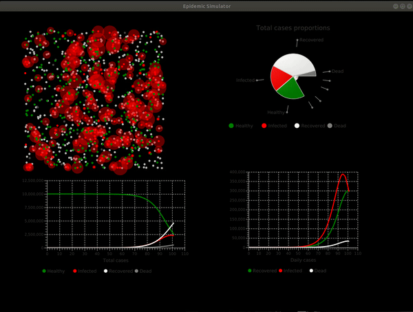

  
  

<h1 align="center">
  Epidemic Simulator
</h1>

>This project allows you to simulate an epidemic. You can monitor the progress of *healthy*, *infected*, *recovered* and *dead* patients every day on multiple charts and visualisations.

## The epidemic parameters
You can start your simulation by passing these essential parameters:
  - Population size
  - Initial number of infected people
  - Incidence rate - [read more](https://en.wikipedia.org/wiki/Incidence_(epidemiology))
  - Mortality rate
  - Disease duration - an avarage time after which the patient recovers (or unfortunately, dies)

## Tools used
The whole application is written in **Scala**, the UI code can be found [here](https://github.com/MikeyZat/epidemic-simulator/tree/master/src/main/scala/ui), while the  simulation logic is [here](https://github.com/MikeyZat/epidemic-simulator/tree/master/src/main/scala/simulation).
| Area | Tool |
| ------ | ------ |
| Visualisation | ScalaFX |
| Simulation Logic | Parallel Monte Carlo samplings |

## Motivation

It was our project for Scala Programming Labolatories at the University. We wanted to make something interesting and entertaining using the power of **Scala**.

## Authors

<table>
  <tr>
    <td align="center"><a href="https://github.com/MikeyZat"> <b>Mikołaj Zatorski</b></a></td>
   <td align="center"><a href="https://github.com/Qizot"> <b>Jakub Perżyło</b></a></td>
    </tr>
</table
